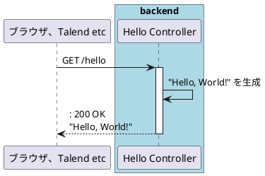

# 作業時間入力
- https://github.com/orgs/mik-organization/projects/7/views/6

# PJ運用
## issue対応について
- 1issue、1ブランチで作業する
- 作業完了時、プルリクを作成する
- プルリクでレビューを実施し、完了後、プルリクをクローズ（マージ）する
## ブランチの作成
- issueの画面から「Create a branch」
- リポジトリ：mik-organization edu-tsujihara
- sourceブランチ：基本的にはmain
- ブランチ名：issue番号-対応内容の概要　例）4-new-pj
  - 全角文字は使用しない
  - 区切りが必要であれば、（ハイフン）か_（アンダースコア、アンダーバー）を使用する
  
## ブランチの切り替え～コミットまで（PowerShellで操作）※追加・更新・削除同様手順
- git branch：現在の作業ブランチを確認
- git checkout ブランチ名：ブランチの切り替え
- git add ファイルパス：コミットしたいファイルを登録
  ※コミットしたい対象のファイルだけを記載する
- git status：追加・更新・削除したファイルが間違いないか確認
- git commit -m "メッセージ"：メッセージをつけて変更履歴を保存
- git push：ローカルリポジトリの内容をリモートリポジトリに送信
## コミットについて
- コミットメッセージは下記のようにする  
issue番号 対応内容の概要　例） #4 新規プロジェクトの追加

# アプリ機能設計
- 機能概要
  - Netflix等動画配信サービスの動画を登録し、レビュー等を行う
  - おすすめ順に表示する
## HelloWorld

# DB接続情報
- DB名：videodb
- ユーザー／パスワード: postgres/postgres

